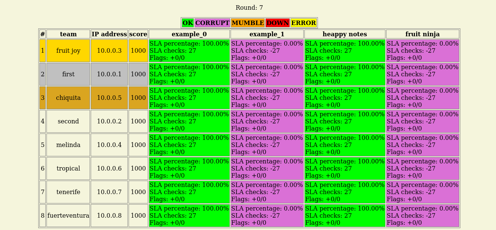
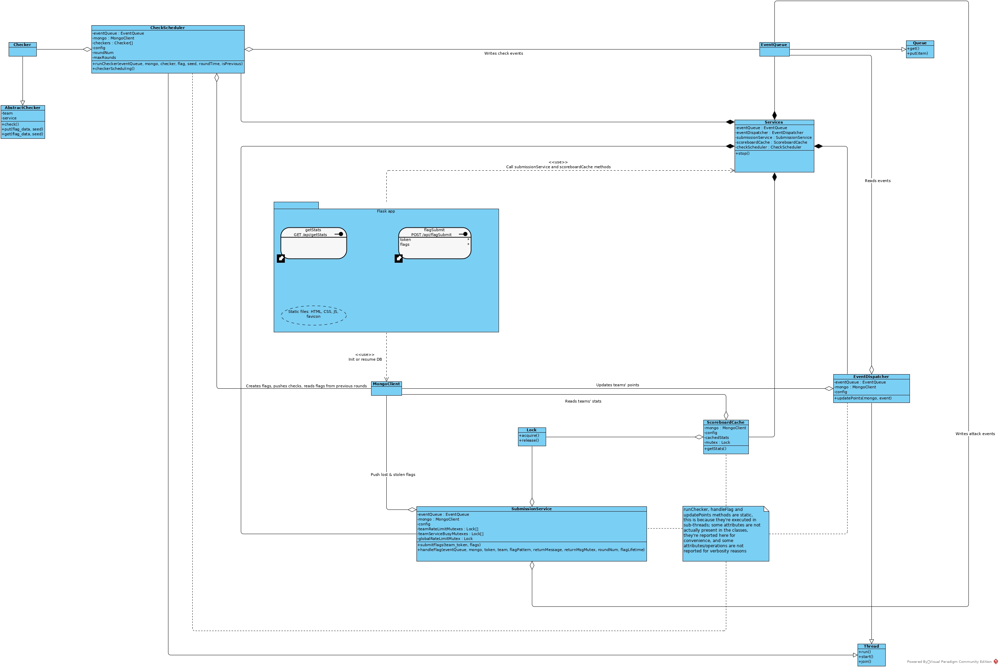
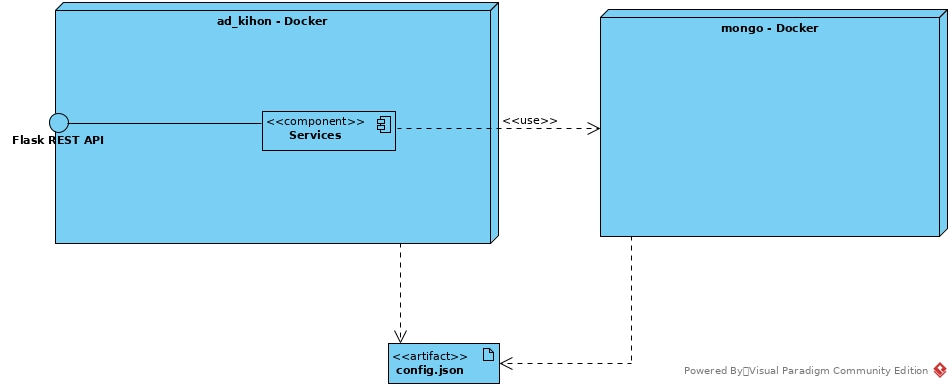

# ad_kihon
"Kihon" in Karate is the set of basic techniques. <br>
This attack/defense framework is called ```ad_kihon``` because it is aimed for team training in a local environment. <br>
Also, it was developed with these requirements in mind:

- Easy & documented architecture ([KISS principle](https://en.wikipedia.org/wiki/KISS_principle)), which enables ```mantainability``` and ```testability```;
- Easy deployment (no local build, just copy the docker-compose which uses the pre-built images, and create a volume folder with the configuration file and the checkers: clone the repository only if you want a clean project structure to write checkers);
- Security: there is an high test coverage of the backend, to handle all the edge cases, input validation for data coming in, some DoS protection and protections against concurrency issues.



## Quickstart
To deploy the platform, you can simply use a ```docker-compose.yml``` with the pre-built images:

```
version: '3'
services:
  mongodb:
    image: mongo
    container_name: mongodb_kihon
    hostname: mongodb_kihon
    user: 1000:1000
    environment:
      - MONGO_INITDB_ROOT_USERNAME=admin
      - MONGO_INITDB_ROOT_PASSWORD=admin
      - TZ=Europe/Rome
    volumes:
      - ./data/db/:/data/db/
    expose:
      - 27017
    restart: on-failure

  app:
    image: shotokhan/ad_kihon:1.0
    container_name: ad_kihon
    hostname: ad_kihon
    environment:
      - TZ=Europe/Rome
    ports:
      - 8080:8080
    volumes:
      - ./volume:/usr/src/app/src/volume
    restart: on-failure
 
```

Your directory will have the following layout:

```
$ tree -a
.
├── data
│   └── db
│       └── .gitkeep
├── docker-compose.yml
└── volume
    ├── checkers
    │   ├── example_checker_0.py
    │   └── example_checker_1.py
    ├── config.json
    └── requirements.txt


```

That's all. You just need to understand how to modify ```config.json``` and, accordingly, the ```docker-compose.yml``` (for example for mongo credentials), and how to write checkers.

## Configuration
An example configuration file is the following:

```
{
    "teams": [
        {"id": 0, "host": "10.0.0.1", "name": "first", "token": "c2e192800a294acbb2ac7dd188502edb"},
        {"id": 1, "host": "10.0.0.2", "name": "second", "token": "934310005a1447b8bd52d9dcbd5c405a"}
    ],
    "services": [
        {"id": 0, "port": 7331, "name": "example_0", "checker": "volume/checkers/example_checker_0.py"},
        {"id": 1, "port": 7332, "name": "example_1", "checker": "volume/checkers/example_checker_1.py"}
    ],
    "mongo": {
        "hostname": "mongodb_kihon", "port": 27017, "db_name": "ad_kihon", "user": "admin", "password": "admin"
    },
    "flask": {
        "port": 8080
    },
    "misc": {
        "start_time": "11 apr 2022 15:30",
        "end_time": "11 apr 2022 19:30",
        "round_time": 120,
        "flag_lifetime": 5,
        "atk_weight": 10,
        "def_weight": 10,
        "sla_weight": 80,
        "flag_header": "flag",
        "flag_body_len": 30,
        "rate_limit_seconds": 5,
        "max_flags_per_submission": 20,
        "scoreboard_cache_update_latency": 5,
        "base_score": 1000,
        "dispatch_frequency": 2
    }
}
```

It is organized in groups of sub-configurations:

- ```teams``` group allows the specification of teams, each one with a unique numeric id, an host used by checkers (that can also be an hostname instead of an IP address), a name (which is shown on the scoreboard, alongside with the host), and a token which must be manually generated (for example as an ```uuid4```) and must be given out-of-band to each team: it is used for flag submission;
- ```services``` group allows the specification of services, each one with a unique numeric id, a port used by checkers, a name shown on the scoreboard and the path of the checker file in the container, relative to ```/usr/src/app/src``` (see the examples above);
- ```mongo``` group allows the specification of the hostname (or IP address) of MongoDB, the port, the database name to use and the credentials (if you change something here, you may have to change the ```docker-compose.yml``` accordingly);
- ```misc``` group allows the tuning of many game parameters, which we will describe in the next sub-paragraph.

### Game parameters
- Start time & end time: they must be in non-ambiguous format because they're parsed using ```dateutil.parser.parse```; the timezone is set using TZ env parameter in ```docker-compose.yml```. The scoreboard is always shown (also before and after the defined time window), but the checkers are scheduled only after start time and until end time (if the gameserver crashes and you start it again, it is able to resume, but it jumps to round X to be able to finish the game in time); flag submission is rejected before start time and after end time.
- Round time: it is expressed in seconds, and the total number of rounds is computed as ```(endTime - startTime) // roundTime```; at the start of each round, checkers are scheduled and each checker divides the round in 3 time slices: a ```check``` at start, a random sleep in ```[0, roundTime//3]```, a ```put``` and another random sleep if it is a new flag, and a ```get```.
- Flag lifetime: this parameter states "for how many rounds a flag is valid after the round in which it has been put", i.e. if the flagLifetime is equal to 5 and a flag is put at round 5, it can be submitted until round 10 (included), and it is get by checkers until round 10 (included). This means that for each flag there are ```flagLifetime + 1``` checks, except for the last rounds' flags.
- Attack weight: it impacts the attack score; the attack score is ```number_of_stolen_flags * atk_weight```.
- Defense weight: it impacts the defense score; the defense score is ```-1 * number_of_lost_flags * def_weight```, and the difference with the attack score is that the same flag can be lost multiples times, if stolen by different teams.
- SLA weight: it impacts the SLA (Service Level Agreement) score; a check gives +1 if it is ```OK```, -1 if it is ```MUMBLE```, ```CORRUPT``` or ```DOWN```, and 0 if it is ```ERROR``` (see checkers' section for more info), so the SLA score is ```sla_checks * sla_weight``` (with ```sla_checks``` we mean the overall checks for all services).
- Flag header & flag body len: with these parameters you have a partial control over the flag regex, for example if flag header is "flag" and flag body len is "30", then flag regex is ```r'flag\{[a-f0-9]{30}\}'```.
- Rate limit seconds: there is the implementation of a token-based rate limit (using mutexes), in which each team can't submit flags more often than ```rate_limit_seconds```.
- Max flags per submission: this is another anti-spam parameter to protect the flag submission service, the reason is that there are many checks that must be made on each flag, which require I/O operations with MongoDB and so the choice was to handle each flag in a different thread. Therefore, it is a good idea to tune this parameter to a reasonably low value, according to the number of teams, the number of services and the flag lifetime (it makes no sense to allow the submission of 100 flags at a time if there are 4 teams, 3 services and flag lifetime is 3: the maximum number of valid flags is ```(4-1)*3*(3+1)=36``` at a given round and then only 9 at the following round, which can also be submitted in small groups of flags without exceeding the rate limit).
- Scoreboard cache update latency: when a client makes a request to get teams' stats, which are shown on the scoreboard, the stats need to be queried from MongoDB, and some elaborations need to be made on them; to optimize this process, it is lazily made not more often than ```scoreboard_cache_update_latency``` seconds and the result is cached. This impacts how much real time the scoreboard can be (but keep in mind that in ```/src/static/index.js``` the client performs a new query with an hard-coded interval of 10 seconds).
- Base score: this is, as the name suggests, the base score that each team has at game start, and the overall score is simply the sum ```base_score + atk_score + def_score + sla_score```.
- Dispatch frequency: there is some redundancy in the DB schema, to not make the scoreboard cache compute the points for each service after each query; this redundancy stands in the fact that each team has a points struct for each service, which is updated by a component called ```EventDispatcher```. The dispatcher reads from a thread-safe queue events generated by the checkers and by the submission service: when the queue is not empty it reads until it is empty, then it sleeps for ```dispatch_frequency``` seconds before trying to read again. So, this parameter should be less than ```scoreboard_cache_update_latency```, but not too low, to avoid unproductive waiting.  


## Checkers
As mentioned previously, you must put checkers in the app's volume. <br>
Each checker has to implement 3 actions: ```check```, ```put```, ```get```. <br>
To write it, you have to implement the ```AbstractChecker``` class:

```
class AbstractChecker:
    # you must implement this class with a class named "Checker" and specify its relative path
    # in config.json; the seed is passed because, usually, checker are stateless, but you have
    # a class for each team and for each service so you can make stateful checkers if you prefer
    def __init__(self, team: dict, service: dict):
        self.team = team
        self.service = service

    def check(self):
        raise NotImplementedError

    def put(self, flag_data: str, seed: str):
        raise NotImplementedError

    def get(self, flag_data: str, seed: str):
        raise NotImplementedError

```

There is one instance of this class for each team and for each service, which is initialized only once at system's startup, so you can make "stateful checkers" if you want (the state doesn't persist after a resume). <br>
The fields ```team``` and ```service``` are used to initialize the checker and are exactly as they are in ```config.json```, so you will always use ```team['host']``` and ```service['port']```. <br>
Look at the parameters of ```put``` and ```get```. <br>
The field ```flag_data``` is the actual flag, and ```seed``` can be used to generate the same credentials in ```put``` and ```get``` actions. Both are unique. <br>
Each action must return one of the following:

- ```OK``` if the service behaves well, in particular the ```get``` action should return ```OK``` if it is able to get the flag (the ```OK``` status is the only status which is only pushed after a ```get```, the other statuses are pushed immediately and interrupt the lifetime of the checker for the round in which they're pushed, see ```runChecker``` method of ```CheckScheduler``` class if you want to understand more);
- ```MUMBLE``` if the service is not working properly, for example if the registration of an user doesn't work;
- ```CORRUPT``` if the service appears to be working, but the flag can't be found;
- ```DOWN``` if the checker can't connect to the service;
- ```ERROR``` if there is an error related to the execution of the checker, not a service's fault (usually you don't have to return this, because the checker's action is wrapped into a try-except block).

There is a library for checkers, which also includes the actual values for these statuses. Let's see a dumb example of a checker:

```
from checker import AbstractChecker
from checker_lib import *


class Checker(AbstractChecker):
    def __init__(self, *args, **kwargs):
        super().__init__(*args, **kwargs)

    def check(self):
        return OK

    def put(self, flag_data: str, seed: str):
        return OK

    def get(self, flag_data: str, seed: str):
        return OK

```

All the utils function that you may want to use (for example, ```randomUserAgent```) are included in a Singleton class, ```CheckerUtils``` (it is a Singleton because it must read some data from some files only once). <br>
You may want to add ```self.utils = CheckerUtils()``` in your checker's ```__init__```, and then call one of its methods:

- ```self.utils.randomUserAgent()``` takes no parameters and returns a string;
- ```self.utils.randomUsername()``` takes no parameters and returns a string;
- ```self.utils.credentialsFromSeed(seed, length)``` takes "seed" as mandatory parameter (string), "length" as optional parameter (int, default=16) and returns a tuple of two strings (username, password); it is a static method.

Last, you may want to include libraries which are not installed in the container; you can specify them in the ```requirements.txt``` file included in the volume: they will be automatically installed at system's startup. <br>
For a more complete example of a checker, you can look [here](https://github.com/Shotokhan/memowotoru/blob/main/volume/memowotoru/memowotoru_checker.py); the linked repository contains a full demo usage of this A/D platform with a vulnerable service, its patched version and the exploits.

## REST API
The REST API is composed of only two endpoints: ```/api/getStats``` and ```/api/flagSubmit```. <br>
The first one is automatically called at periodic intervals by ```index.js```, on client-side, which also renders the scoreboard. <br>
Here is a ```curl``` command for it with an example output:

```
$ curl -X GET http://127.0.0.1:8080/api/getStats
{"teams": [{"ip_addr": "10.0.0.1", "name": "first", "points": {"example_0": {"atk_pts": 10, "def_pts": 0, "sla_pts": 285}, "example_1": {"atk_pts": 0, "def_pts": -25, "sla_pts": -285}}, "last_pts_update": 1650383468, "overall_score": 850, "service_status": {"example_0": "ok", "example_1": "error"}}, {"ip_addr": "10.0.0.2", "name": "second", "points": {"example_0": {"atk_pts": 0, "def_pts": -10, "sla_pts": 285}, "example_1": {"atk_pts": 25, "def_pts": 0, "sla_pts": -285}}, "last_pts_update": 1650383457, "overall_score": 1150, "service_status": {"example_0": "ok", "example_1": "corrupt"}}], "roundNum": 50, "flagLifetime": 5}
```

For the second endpoint there isn't a frontend, so you must refer to this ```curl``` command:

```
$ curl -X POST http://127.0.0.1:8080/api/flagSubmit -H 'Content-Type: application/json' -d '{"token": "c2e192800a294acbb2ac7dd188502edb", "flags": ["flag{61b858b581964ed2b4935987be306b}"]}'
{"num_invalid": 0, "num_accepted": 1, "num_already_submitted": 0, "num_self_flags": 0, "num_discarded": 0, "num_old": 0}
```

You have to call the endpoint by POSTing a JSON, with two parameters: the team ```token```, as a string, and the ```flags```, as a list of strings. <br>
A possible submitter in Python, which doesn't exceed ```rate_limit_seconds``` and ```max_flags_per_submission``` (teams participating to the CTF should know these parameters out-of-band):

```
import requests
import time


url = "http://127.0.0.1:8080/api/flagSubmit"
token = "934310005a1447b8bd52d9dcbd5c405a"
max_submit = 20
rate_limit = 5


def make_req(token, flags):
    return requests.post(url, json={"token": token, "flags": flags})


def submit(flags):
    flags = list(flags)
    if len(flags) > max_submit:
        flags = [flags[i:i+max_submit] for i in range(0, len(flags), 20)]
        for sub_flags in flags:
            print(sub_flags)
            r = make_req(token, sub_flags)
            print(r.text)
            time.sleep(rate_limit)
    else:
        print(flags)
        r = make_req(token, flags)
        print(r.text)
```

Now, let's explain the return types of this endpoint: ```invalid```, ```accepted```, ```already_submitted```, ```self_flags```, ```discarded```, ```old```. <br>
As you may have noticed, there is a counter for each type. We will show the types in the some order in which they are enforced by the flag submission service. <br>
A flag is:

- ```discarded``` if its index in the list of flags exceed ```max_flags_per_submission - 1```;
- ```invalid``` if it doesn't match the flag regex or if it doesn't exist in the database;
- in ```self_flags``` if the team token provided matches the team which owns the flag (no points are subtracted to the team);
- ```old``` if ```flagRoundNum < currentRoundNum - flagLifetime```; 
- ```already_submitted``` if it was already submitted by the team which is making the current submission (no race conditions, see ```SubmissionService``` class); 
- ```accepted``` in any other case (attack points are given to the team which made the submission, defense points are subtracted to the team which owns the flag).

## Tests
In ```/src/test``` subfolder you can find tests for many modules, functions and for the integration among them. <br>
Each test file, which includes a set of test cases, is executed by calling the Python interpreter on it, for example ```python test_check_scheduler.py```; there is also a ```requirements.txt``` file for tests. <br>
TODO: a driver test module (with ```pytest``` or ```unittest```) to execute all tests, without re-inventing the wheel.

## Architecture
Navigate through this diagram:



Maybe it's too big to fit in your screen, but it should be self-explanatory if you manage to follow it, because it's very detailed. <br>
Start from ```Flask app```, then go to ```Services``` and from there choose one of its five paths, then go back and take another path, and so on. <br> 
To get more details, you should dive into source code, which shouldn't be much hard to read & modify, thanks to the detailed explanation of game parameters, checkers and the detailed class diagram. <br>
It's also useful to have a deployment diagram:



Only two other things need to be documented: the ```Event``` format and the DB schema. <br>
Each event is a dictionary (with the idea that it is JSON-serializable if you decide to have a networked queue instead of thread queue). <br>
There are two types of events: ```check``` and ```attack```. <br>
Event formats:

```
{"type": EVENT_CHECK, "status": Union(OK, DOWN, MUMBLE, CORRUPT, ERROR), "team": team_id, "service": service_id, "timestamp": int_timestamp}

{"type": EVENT_ATTACK, "team": team_id, "service": service_id, "attacked_team": attacked_team_id, "timestamp": int_timestamp}
```

Now, the DB schema. <br>
There are 3 collections: ```team```, ```service``` and ```flag```. <br>
The easiest one is ```service```:

```
{"service_id": service_id, "port": port, "name": name}
```

Where ```service_id``` is enforced to be unique. <br>
The ```flag``` collection is also straightforward:

```
{"flag_data": flag_data, "seed": seed, "round_num": round_num, "team_id": team_id, "service_id": service_id}
```

The field ```flag_data``` is indexed because it is heavily used by the SubmissionService to check if a flag exists. <br>
Each element of the ```team``` collection is created in multiple steps. <br>
The first step inserts a document of this format:

```
{"team_id": team_id, "ip_addr": ip_addr, "name": name, "token": token, "points": [], "stolen_flags": [], "lost_flags": [], "checks": [], "last_pts_update": 0}
```

Then, ```points``` have to be initialized, for each ```service```:

```
{"service_id": service['service_id'], "atk_pts": 0, "def_pts": 0, "sla_pts": 0}
```

This is done by using the MongoDB's ```$push``` operator. <br>
This operator is also used by the ```CheckScheduler``` to push checks, and by the ```SubmissionService``` to push stolen flags and lost flags; points are then updated by the ```EventDispatcher``` using the ```$set``` operator (it also updates the ```last_pts_update``` field with the event timestamp). <br>
Stolen flags and lost flags have the same format:

```
{"flag_data": flag_data, "timestamp": timestamp}
```

The difference is that in ```stolen_flags``` the field ```flag_data``` must be unique (enforced by the ```SubmissionService```). <br>
They don't keep track of things like service, attacked team and so on because these attributes can be queried from the ```flag``` collection using ```flag_data```. <br>
Checks, on the opposite hand, need to keep track of the ```service_id```. Their format is:

```
{"service_id": service_id, "status": status, "timestamp": timestamp}
```

The presence of timestamps allows the possibility of computing a score plot over time, which would be an enhancement, and the query for the last status check of a team's service. <br>
If the system crashes, the events on the ```EventQueue``` will be lost, but the checks and the stolen & lost flags already pushed can be used to resume points at the following startup. <br>
There is an ```init_or_resume_mongo``` function in ```/src/project_utils.py``` that is called each time the system is started, and that is able to handle both the first startup and the resume. <br>
If the system doesn't crash but receives a ```SIGINT```, it tries to complete pending jobs before exiting.
